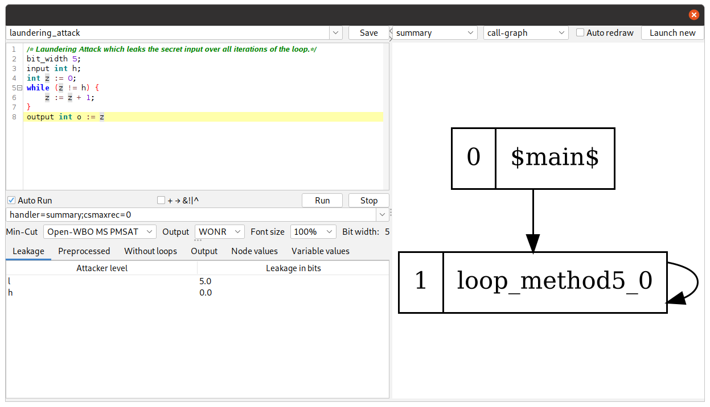

Nildumu
=======

An experimental quantitative information flow analysis 
for a while-language with functions, arrays and a C like syntax. 
Example programs can be found in the `examples` and 
the `eval-specimen` (file ending `.nd`, from the evaluation) directory.

TL;DR: To reproduce the results of the paper or to run the analysis,
create a docker container using the Dockerfile in this folder
and run `./evaluation` inside the container (it takes around 3 days) and optionally 
pass `--programs small --runs 1` (it now takes around 10 Minutes on an Intel i5-8500),
or use the `run` script to run specific programs:
```
sudo docker run -i parttimenerd/nildumu ./evaluation --programs small --runs 1
# analyze a program (with inlining level 32) from standard in
sudo docker run -i parttimenerd/nildumu ./run << EOF
input int h; output int o := h | 1
EOF
```

Usage
-----

Nildumu can be used either via its command line application `./run`, 
via an editor `./gui` or via the evaluation script `./evaluation`.

### Command Line Application
A command line that can be used to run programs 
(passed either via standard in or via a passed file name).
```
Usage: ./run [-hV] [--algo=<algo>] [--handler=<handler>]
             [-ra=<recordAlternatives>] [-tl=<transformLoops>]
             [-tp=<transformPlus>] <programPath>
Run nildumu on the command line. Example programs are given in the folders
'eval-specimen' and 'examples'. The syntax of the paper is accepted too.
      <programPath>         program file to analyze, or '-' to read from
                              standard in. Nildumu files usually end with '.nd'.
                              Default: -
      --algo=<algo>         Used leakage computation algorithm, default is
                              OpenWBO PMSAT based
                              Default: Open-WBO GL PMSAT
  -h, --help                Show this help message and exit.
      --handler=<handler>   Method invocation handler configuration, for paper:
                              'handler=inlining;maxrec=INLINING;bot=summary'
                              Default: handler=inlining;maxrec=32;bot=summary
      -ra, --recordAlternatives=<recordAlternatives>

      -tl, --transformLoops=<transformLoops>

      -tp, --transformPlus=<transformPlus>

  -V, --version             Print version information and exit.
```
You can also run this command inside the docker image 
(build it via `sudo docker build -t nildumu .`, run it via `sudo docker run -it nildumu`)
or use it directly, for example:
```
    # directly (or in docker image)
    ./run examples/laundering_attack.nd
    # via docker image from dockerhub
    sudo docker run -i parttimenerd/nildumu ./run examples/laundering_attack.nd
```

An example execution is:
``` 
```

### Evaluation
Create the docker image (via `sudo docker build -t nildumu .`) which
takes around 4 minutes on an Intel(R) Core(TM) i5-8500 with 32GiB of RAM) and
then run the evaluation inside the docker container, or use the docker image
from dockerhub:
```
# run one single iteration, this takes 10 minutes and max. 7GiB RAM on an Intel(R) Core(TM) i5-8500
# and excludes the longer running E-Voting examples
sudo docker run -i parttimenerd/nildumu ./evaluation --runs 1 --programs small

# to run all benchmarks, pass `--programs all` (takes n minutes)
sudo docker run -i parttimenerd/nildumu ./evaluation --runs 1 --programs all

# to obtain the "exact" leakages for the E-Voting and Smart Grid programs, run
sudo docker run -i parttimenerd/nildumu ./evaluation --runs 1 --programs all --tools exact
```
The evaluation commands print the evaluation results.

### Nildumu Editor UI

An editor front-end for nildumu which gives additional information.
Run it via `./gui`, requires Java >= 8

Language
--------
The language is loosely C based. See the beforementioned examples and the documented grammar at `src/main/antlr4/Lang.g4`.

UI
---
The following describes the UI (launch it via `./gui`).
All configurations and inputs are stored continously in the
`gui.config` file, they are brought back after a restart of a program

- the top combobox allows to access different examples from the
  `examples` folder and to store the current program there in,
  using the "Save" button
- the text input allows to input the program, it supports basic
  auto completions, syntax highlighting, code folding and syntax error
  highlighting
- the checkbox labeled "Auto Run"
    - if checked, the input program is analysed continously
    - only use this for small programs with short analysis times
- the checkbox labeled `+ → &!|^`
    - if checked, all `+` and `-` operators will replaced by their
      respective bit operation networks
    - this yields to a far worse perfomance, but has theorectial
      advantages
    - there is no difference in the leakage computation
- the combobox labeled *Output*
    - `MIN`: only update the *Leakage* table
    - `WONR`: also update the *Variable values* table
    - `ALL`: also update the *Node values* table and output debug
      information on the console
- the button labeled "Run"
    - run the analysis, changes to `…` during the run of the analysis
- the button labeled "Stop"
    - abort the current run of the analysis
- the big combobox below
   - it allows the selection and configuration of the method handler that handles
     the method invocations
   - some example configurations are already included
   - it uses as syntax the standard Java property syntax, using `;`
     instead of line breaks
   - handlers are selected using the property `handler`
        - if this misses and the configuration string just consists of
          a single identifier, then this identifier is considered as
          the chosen handler
   - the `basic` handler (`all` handler in the paper)
        - this is the default handler, that just connects returns
          a return value for every function call in which every bit
          depends on every parameter bit
        - this yields to maximal over-approximation, but it is fast
          and therefore used as default handler to gather some kind of
          basis for other handlers
   - the `inlining` handler
        - A call string based handler that just inlines a function.
        - If a function was inlined in the current call path more
          than a defined number of times (`maxRec`), then another
          handler is used to compute a conservative approximation
        - properties
            - `maxrec`: default is `2`
            - `bot`: the handler for the overapproximation, just
              a handler configuration, as the current one
                - allows to chain handlers, it might be useful to use
                  the `summary` handler here
                - default is `basic`
   - the `summary` handler
        - A summary-edge based handler.
        - It creates for each function beforehand summary edges:
            - these edges connect the parameter bits and the return bits
        - The analysis assumes that all parameter bits might have a
          statically unknown value.
        - The summary-edge analysis builds the summary edges using a
          fix point iteration over the call graph.
        - Each analysis of a method runs the normal analysis of the
          method body and uses the prior summary edges if a method is
          called in the body.
        - The resulting bit graph is then reduced.
        - It supports coinduction (`mode=coind`)
          and induction (`mode=ind`), but the default is to choose
          induction for non-recursive programs and else coinduction
          (`mode=auto`)
        - Induction starts with no edges between parameter bits and
          return bits and iterates till no new connection between a
          return bit and a parameter bit is added.
            - It only works for programs without recursion.
        - Coinduction starts with the an over approximation produced by
          another handler (`bot` property) and iterates at most a
          configurable number of times (`maxiter` property), by default
          this number is 2147483647 (the maximum number of signed 32 bit
          integer)
        - The default reduction policy is to connect all return bits
          with all parameter bits that they depend upon
          ("reduction=basic")
            - An improved version (`reduction=mincut`) includes the
              minimal cut bits of the bit graph from the return to the
              parameter bits, assuming that the return bits have
              infinite weights
        - properties
            - `maxiter`: maximum number of iterations for the
              coinduction, as every intermediate state is also valid
            - `bot`: default is `basic` only used for `coind`
            - `mode`: `ind` or `coind`, default is `ind`
            - `reduction`: reduction policy, either `basic` or `mincut`,
              default is `mincut`
            - `dot`: folder to output dot files for the bit graphs of
              the methods in different iterations and the call-graph
                - default: empty string, produces no dot files
            - `csmaxrec`: if > 0, each sub analysis uses a call-string
              based handler for evaluation method invocations, using
              the computed summary edges as `bot` and the passed value
              as `maxrec`. Likely improves precision but also increases
              the size of the summary edges.
- the combobox labeled *Min-Cut* allows to choose between several
  minimum-cut algorithms for the analysis
- the tabs below
    - *Leakage*: contains the leakage of information from higher or
      non-comparable security levels into each security level
    - *Preprocessed*: contains the SSA resolved version of the program
      with some operators replaced
    - *Without loops*: contains the program with all loops replaced by recursion
    - *Output*: Just some statistics
    - *Node values*: the values of the AST/PDG-nodes at the end of the
      analysis
    - *Variable values*: the values of the variables in the program
      at the end of the analysis
- the graph view on the right
    - opens a new frame to view different graphs
    - the graphs are not created in the `MIN` output mode
    - zooming in the graph works by pressing the *Shift* key and
      moving the mouse up or down while pressing an arbitrary mouse key

License
-------
It's licensed under the GPLv3 and MIT license.
